# General Assembly WDI Project 3: Aldojo

[Heroku Pages](https://aldojo.herokuapp.com/)

[GitHub Repo](https://github.com/huangfuin1101/wdi-project-three-aldojo)

Aldojo is a travelling info app created by Alex(Al), Doris(Do) and Josh(Jo) aiming for traveler to use as a tour guide. Users have the access to a variety of different features of the app when register and login, such as adding more countries, creating, editing and deleting food on particular country. User can also review the country, food and even vote for the food. On the profile page, user can see the record of the food and the country they have reviewed.

Aldojo was my third project of General Assembly's Web Development Immersive. It was a group project built on 7 days with two colleagues and it also was my first go of  MEAN stack app technologies.


## Home page
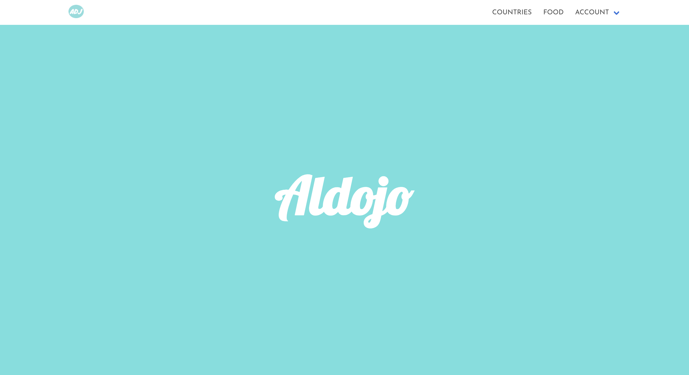


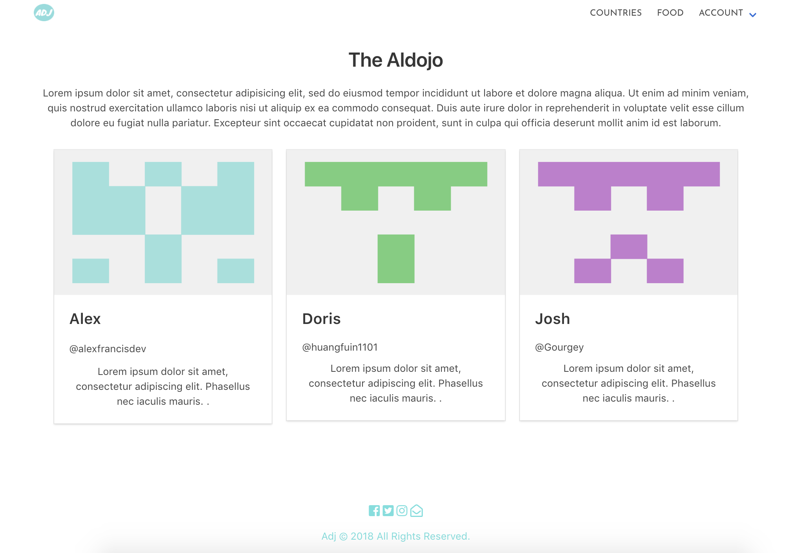


## Register

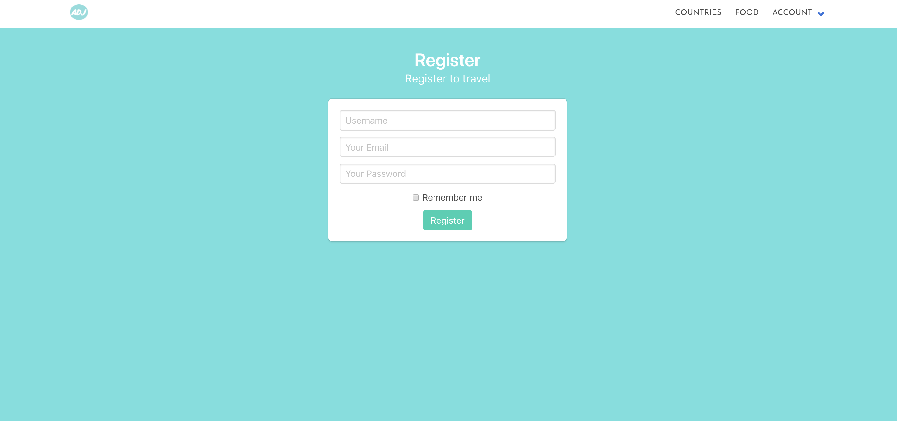


## Login

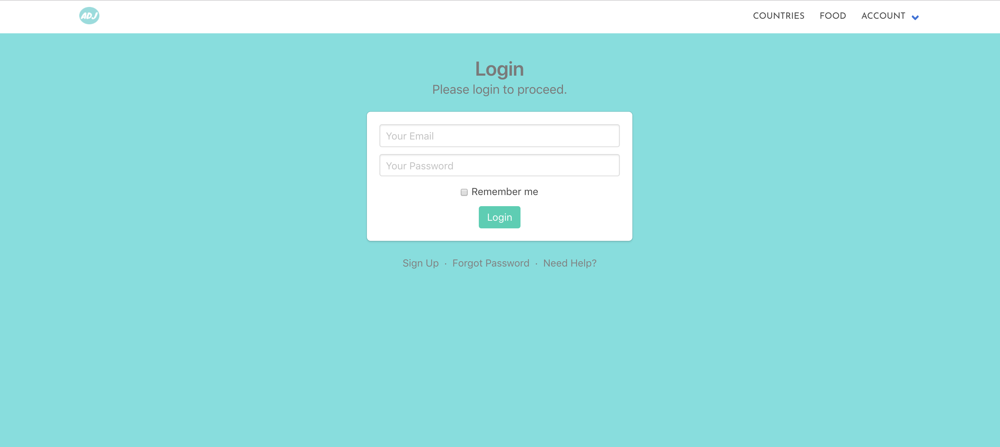


## Search a country


## Inside a country
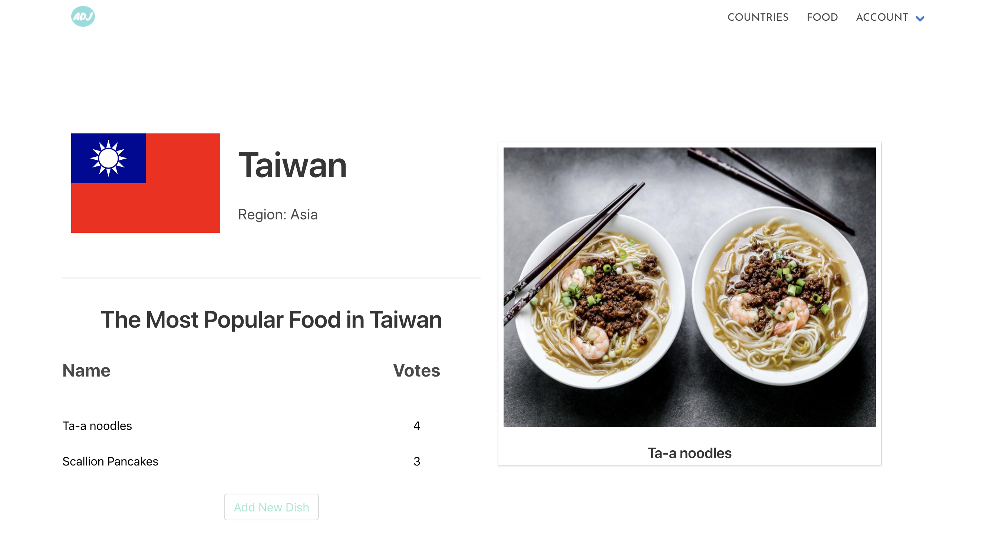


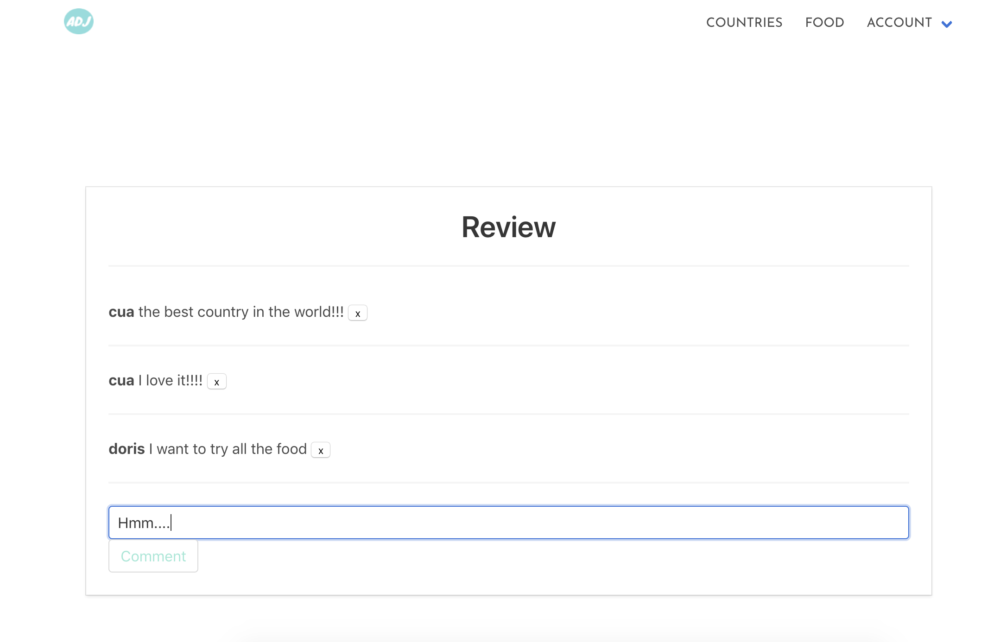

## Add a cuuntry
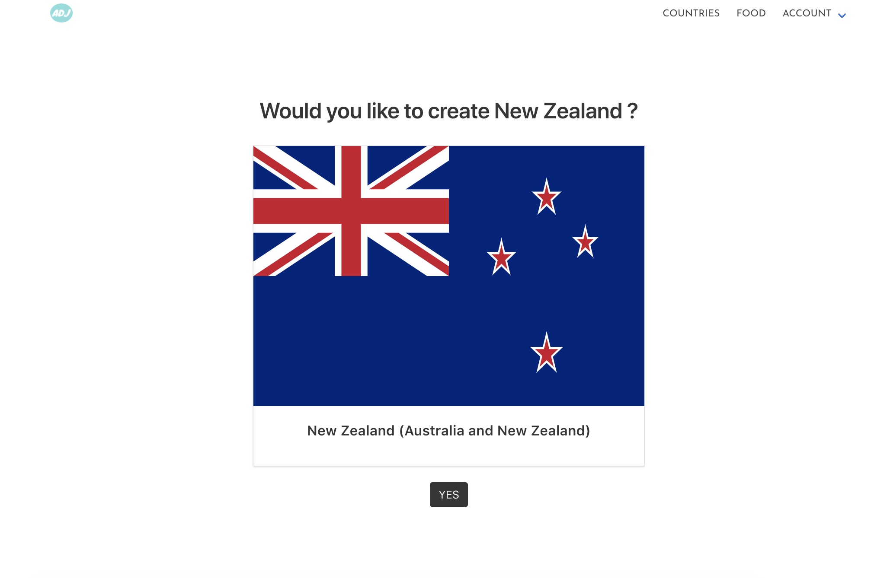

## Looking for food


## Found the food
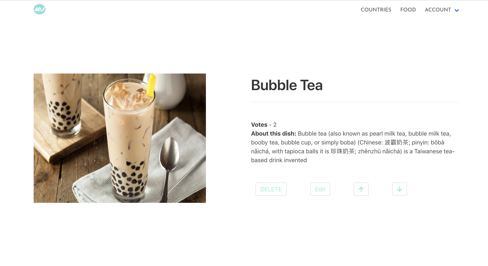

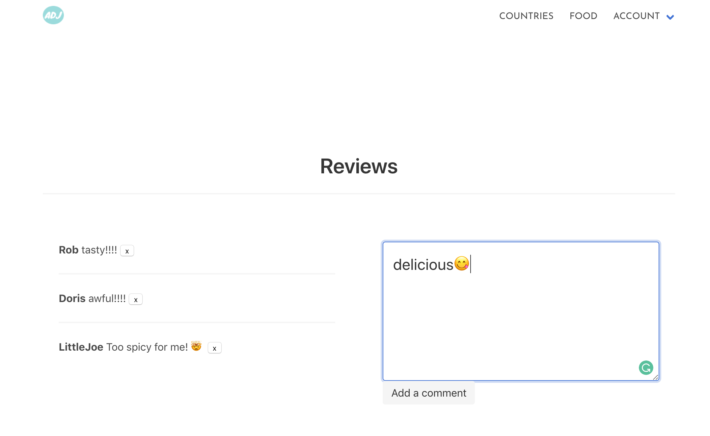


## Profile page
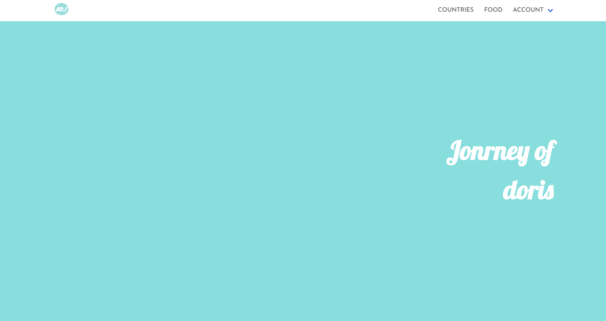

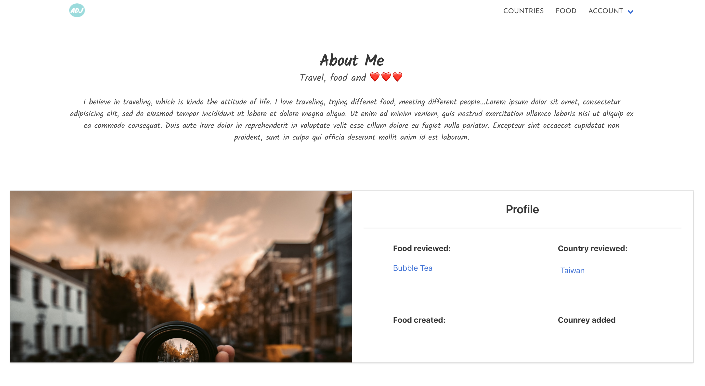


## Responsive mode
### Home page
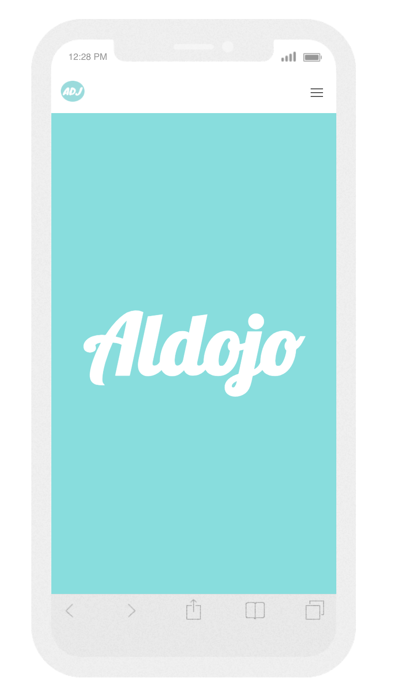

### Food show page
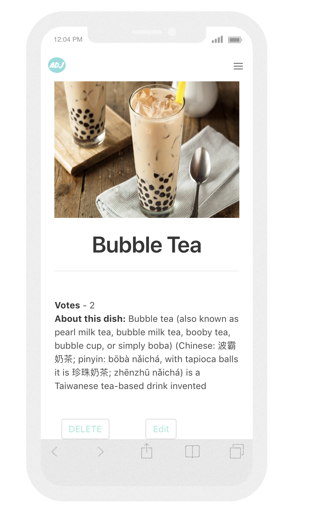

### Profile
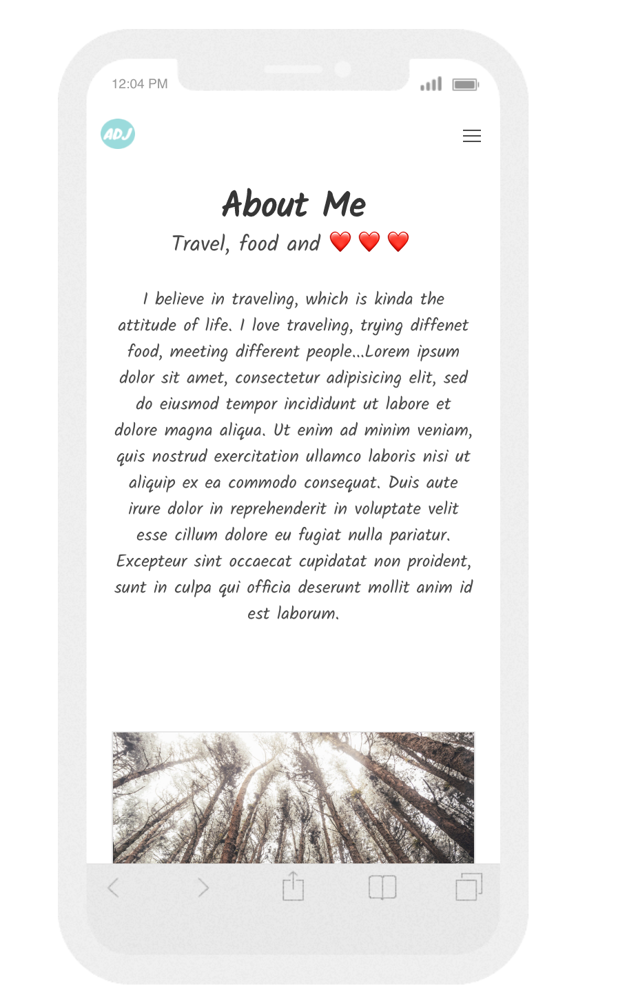


## Technologies Used

* Git
* GitHub
* Heroku
* HTML5
* Node.js
* MongoDB
* express: v4.16.4
* express-ejs-layout: v2.5.0
* ejs: v2.6.1
* express-session: v1.15.6
* body-parser: v1.18.3
* mongoose: v5.3.7
* method-override: v3.5.0
* JavaScript (ECMAScript 6)
* AngularJS
* morgan: v1.9.1
* @uirouter/angularjs: v1.0.20
* satellizer: v0.15.5
* bcrypt: v3.0.0
* jsonwebtoken: v8.3.0
* bluebird: v3.5.1
* chai: v4.1.2
* mocha: v5.2.0
* CSS3 with animation
* Bulma
* Sass
* Google Fonts
* Favicon
* Trello


### APIs Used
* REST Countries


## Approach Taken

We tried to build the backend routes and tested in Insomnia to make sure it was solid. We worked on building basic RESTful routes for country, food and the user at the beginning. Then we moved to frontend, make sure it worked probably and we used external API to get the date of all the countries.


### Brief
To design and build a MEAN stack app with our own design by partnering with other classmates.
The app must :

#### Server-side

* Use Mongo, Node & Express
* At least 2 related models, one of which should be a user
* Should include all RESTFUL actions for at least one of those models
* Include authentication to restrict access to appropriate users
* Include at least one referenced or embedded sub-document
* Include automated tests


#### Client-side

* Use Angular to build a front-end that consumes your API
* Use SCSS instead of CSS
* Use Webpack & Yarn to manage dependencies and compile source code


### Featured Piece of Code no.1
This is how we use external API to get all the country data, and use the country alpha3Code as the url of each individal country. When sending a request for a country, if the country it's in our database, will go stright to the country Show page, if not, will diresct to country New page to create a new page.
From src/controllers/countries/indexCtrl.js and src/controllers/countries/showCtrl.js
```
function indexCtrl($state, $scope, $http) {
  $http({
    method: 'GET',
    url: 'https://restcountries.eu/rest/v2/all',
    skipAuthorization: true
  }).then(result => {
    console.log(result);
    $scope.countries = result.data;
  });
  $scope.findCountry = function() {
    $http({
      method: 'GET',
      url: `https://restcountries.eu/rest/v2/name/${$scope.searchTerm}`,
      skipAuthorization: true
    }).then(result => {
      $scope.searchResults = result.data;
    });
  };
}


function showCtrl($state, $scope, $http, $location) {
  $http({
    method: 'GET',
    url: `/api/countries/alpha3/${$state.params.alpha3Code}`
  }).then(result => {
    if (result.data) {
      console.log(result.data, 'result datas');
      $scope.country = result.data;
    } else {
      $location.path(`/countries/new/${$state.params.alpha3Code}`).replace();
    }
  });
```
### Featured Piece of Code no.2
This is for vote/unvote a particular food. Each user can only vote once for the same food. It checked if the user has been voted for the particular food, then the vote of the food wouldn't increase. If the user has voted the food, the user can remove the vote.
From controllers/voteController.js

```
function vote(req, res, next) {
  Food
    .findById(req.params.foodId)
    .then(food => {
      if (!food.votes.find(userId => userId.toString() === req.tokenUserId)) {
        food.votes.push(req.tokenUserId);
        return food.save();
      } else {
        res.status(422).json({ message: 'Cannot vote twice'});
        next();
      }
    })
    .then(food => res.json(food))
    .catch(next);
}

function unvote(req, res, next) {
  Food
    .findById(req.params.foodId)
    .then(food => {
      if (!food.votes.find(userId => userId.toString() === req.tokenUserId)) {
        res.status(422).json({ message: 'No vote to remove'});
      } else {
        food.votes = food.votes.filter(x => x.toString() !== req.tokenUserId);
        return food.save();
      }
    })
    .then(food => res.json(food))
    .catch(next);
}
```
### Featured Piece of Code no.3
When user has reviewd a country/food for more than once, it will only appear once on the profile page by filtering the country/food index in the array.
From src/controllers/profileCtrl.js

```
function profileCtrl($scope, $http, $state) {
  $http({
    method: 'GET',
    url: `/api/users/${$state.params.id}`
  }).then(result => {
    console.log('the result is', result);
    $scope.commentAuthor = result.data;
    $scope.commentAuthor.countryComments = $scope.commentAuthor.countryComments.sort().filter((country, index, array) => {
      if(index === 0) return true;
      return array[index - 1].id !== country.id;
    });
    $scope.commentAuthor.foodComments = $scope.commentAuthor.foodComments.sort().filter((food, index, array) => {
      if(index === 0) return true;
      return array[index - 1].id !== food.id;
    });
  });
}
```

### Styling

We created our logo using Tiffiny green similar colour as the colour scheme for the app, presenting a user friendly and welcoming atmosphere followed by minimalist design as the priority is to show the information clearly.  

### Wins and Blockers

The big win for us as a team I would say is the teamwork. Every one has contributed each part of the app, from backend, front and the styling.

Our biggest challenge would be at the beginning that we couldn't get the countryShow route done for the confusion of the reference between country and food. The vote and uovote for the food is another challenge as we realised that token is an object instead of a string.
When we had basic RESTful routes done, it took us about 2 days to apply the external API.
As for myself, write code test is a big challenge as I have only practiced little and have not too many ideas on writing the test and what to teat for.  

### Future Features

* Show the country and food that user has created on user profile page.
* Show the food that user has voted on the user profile page.
* Write entire code test for backend routes.
* Apply external API (map) for the location of each country and the food.
* Create another route for user to manage their own profile.
* Improve responsive design.
* Increase more catalogues such as books and special events of the country.
